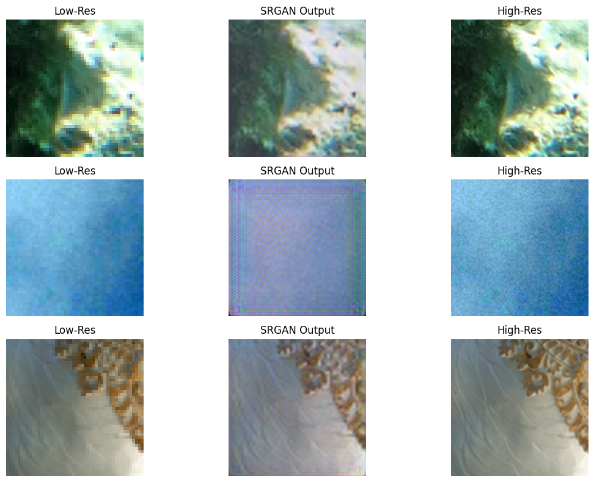

# BMEVITMMA19-Enhancing-Image-Super-Resolution-with-Generative-Adversarial-Networks
BMEVITMMA19 task: SRGAN implementation

Team members:
- Marco Aiello     - J9PDZZ
- Mend-Amar Badral - HSTV4I
- Thipphsone Phaxy - FQ9TSP

## 1.Project description
This project is a study of the Image Super Resolution (ISR) domain and will implement GAN-based models, particularily SRGAN and ESRGAN using the PyTorch framework. The goal is to generate higher resolution images from lower resolution images. Our overarching goal is to compare traditional interpolation methods such as bilinear and bicubic to GAN-based methods. We've taken special importance on implementing the SRGAN network, with comments to help to understand the network architecture.

## 2. Datasets overview
### Div2k
Div2k is a large high quality image dataset specifically for the ISR problem domain. It is introduced in [NTIRE 2017 Challenge on Single Image Super-Resolution: Dataset and Study](https://openaccess.thecvf.com/content_cvpr_2017_workshops/w12/papers/Agustsson_NTIRE_2017_Challenge_CVPR_2017_paper.pdf). It is also one of the suggested datasets for the assignment.

This dataset is a collection of 1000 2K resolution images divided into:
- `train` - 800
- `validation` - 100
- `test` - 100
It provides x2, x3 and x4 downsized images using bicubic and "unknown" methods.

A subset of 400 image pairs from the 'train' set was used in this implementation for training purposes. This was done for two reasons. This subset was uploaded to Huggingface and is remotely downloaded when the solution is ran.
1. To avoid Huggingface download limits we ran into while preparing the dataset
2. Reduce the computational resources required for training the models over high epoch counts. This arose from another issue we ran into where Google Colab restricted our GPU useage during one of our earlier tests.

### CelebA
CelebA is a large-scale face attributes dataset with more than 200K celebrity images. It was not used for this implementation. This is the other suggested dataset for the assignment. It will be used in our ESRGAN implementation.

### Details on how the `datasets` was downloaded and used
The Div2K data was first uploaded to `huggingface` repository by `@mAiello00` which can be used by `datasets` library to download locally. The huggingface authorization token that is part of the notebook will allow access to this dataset. 

For downloading the dataset to local instance (on Colab), we've used:
```python
import os
from huggingface_hub import snapshot_download
dataset_dir = snapshot_download(repo_id="mAiello00/DIV2K", repo_type="dataset")
print("Dataset contains: ", os.listdir(dataset_dir))
high_res_dir = os.path.join(dataset_dir, "DIV2K_train_HR")
low_res_dir  = os.path.join(dataset_dir, "DIV2K_train_LR_bicubic_X2", "DIV2K_train_LR_bicubic", "X2") # Downscaled 2 times images
```
After running a code snippet above, the `huggingface_hub` library would download the dataset and return the `high_res_dir` and `low_res_dir`. For ISR problem, high resolution images correspond to ground truths and low resolution images are inputs to the network.

## 3. Results

The trained network is able to output following image for super resolution image task, meaning upsampled the low resolution image.




## Instructions to run the solution
The `jupyter` notebook will be uploaded. Download the file titled 'SRGAN Implementation'. Pressing 'Run' on each of the cells in order (top-to-bottom) will produce the expected results.

## SRGAN Paper

1. [SRGAN Paper](https://openaccess.thecvf.com/content_cvpr_2017/papers/Ledig_Photo-Realistic_Single_Image_CVPR_2017_paper.pdf)
